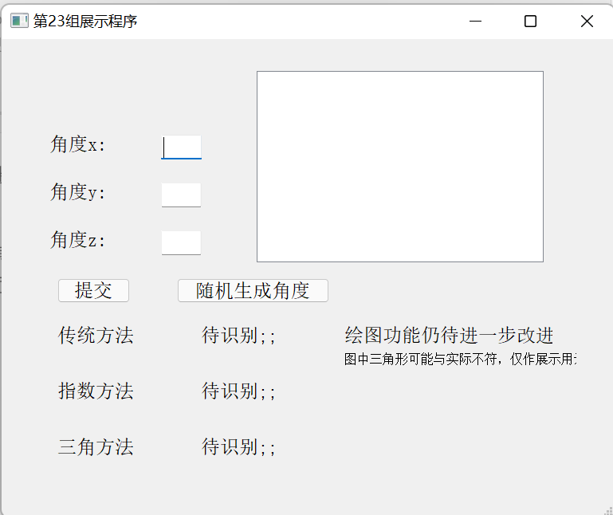
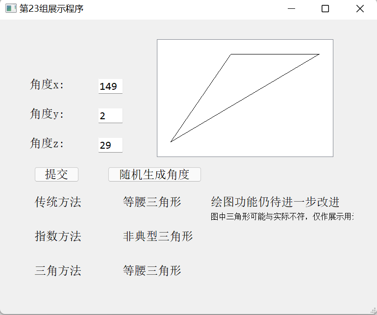

## 使用pyqt5实现的三角形模糊识别简单小程序

## 文章的主体

1. 引入三角形模糊识别问题，介绍基本的概念

2. 展示多种不同的三角新隶属度，并且附上代码的解释

3. 展示UI界面

### 

### 问题由来以及简单介绍

学校的软计算方法作业，需要进行三角形模糊模式识别，在完成任务后，萌生了记录到博客的想法(偷笑)，也想有一些总结或者新的思路。这个问题用到了模糊数学的知识，以及python pyqt，类的一些知识。

### 问题的描述

  在日常中的三角形常常是模糊的，也就是不能够直接的划分成为等边三角形，等腰三角形等三角形，为此我们可以使用模糊数学的方法，为每一类三角形引入一个隶属度，输入三个角度，输出一个隶属度的值，最终根据每类三角形隶属度的大小决定这三个角度组成的三角形为哪一类三角形。

  在本文中，为解决模糊和不确定性的三角形识别问题。我们引入模糊集合、隶属函数用于处理三角形模糊识别问题，同时根据三角形的性质来设计模糊隶属度函数，完成三角形的识别问题。

- 等边三角形性质：三角形的三个内角必定两两相等。

- 等腰三角形性质：三角形的三个内角存在两个内角相等。

- 直角三角形性质：三角形的三个内角必定存在一个内角为。

- 等腰直角三角形性质：三角形的三个内角必定有一个角为，其余两个为。- 

- 非典型三角形性质：三角形的三个内角和为，他是除了具有特殊性质以为的其他三角形的总称。

### 三角形识别方法

简单三角形的隶属度公式


等腰直角三角形为直角三角形，等腰三角形隶属度间取最小的一个，非典型三角形为等腰三角形，等边三角形，直角三角形三种三角形补集取小。补集的计算公式为：

$\mu_{R^c} = 1-\mu_{R}$

对应的python类如下(使用math库)：

首先是基于简单模糊的三角形模糊识别方法(**完整代码在文末**)：

```python
class classify_triangle_tradition():
    """function dict contain different function about triangle """
    def __init__(self,init_angle=None,function_dict=None):
        self.init_angle = init_angle
        if function_dict:
            self.function_dict = function_dict
        else:
            self.function_dict={
                "equilateral_triangle": self.equilateral_triangle,
                "isosceles_triangle": self.isosceles_triangle,
                "right_triangle": self.right_triangle,
                "right_isosceles_triangle": self.right_isosceles_triangle,
                "non_typical_triangle": self.non_typical_triangle
            }
        self.rename_dict= {
                "equilateral_triangle": '等边三角形',
                "isosceles_triangle": '等腰三角形',
                "right_triangle": '直角三角形',
                "right_isosceles_triangle": '等腰直角三角形',
                "non_typical_triangle": '非典型三角形'
            }
    def input_angle(self,a,b,c):
        """change angle"""
        self.init_angle=(a,b,c)

    def equilateral_triangle(self,x, y, z):
        # 等边三角形
        return 1 - (1 / 180) * max(x - y, y - z)

    def isosceles_triangle(self,x, y, z):
        # 等腰三角形
        return 1 - (1 / 60) * min(x - y, y - z)

    def right_triangle(self,x, y, z):
        # 直角三角形
        return 1 - (1 / 90) * abs(x - 90)

    def right_isosceles_triangle(self,x, y, z):
        # 等腰直角三角形
        return min(self.right_triangle(x, y, z), self.isosceles_triangle(x, y, z))

    def non_typical_triangle(self,x, y, z):
        # 非典型三角形
        return min(1 - self.isosceles_triangle(x, y, z), 1 - self.right_triangle(x, y, z), 1 - self.equilateral_triangle(x, y, z))

    def get_once(self):
        """choose max fitness value's and return that triangle """
        a,b,c = self.init_angle
        return {name:func(a,b,c) for name,func in self.function_dict.items()}

    def cal_res(self):
        res = self.get_once()
        value_list = sorted(res.items(),key=lambda x:x[1],reverse=True)
        res = value_list[0][0]
        return self.rename_dict[res]
```

`cal_res`函数计算隶属度最高的三角形，`get_once`函数计算各个三角形的隶属度。

其次是基于指数型隶属函数的三角形模糊识别方法，指数函数的隶属函数如下：


代码如下:

```python
class classify_triangle_exp(classify_triangle_tradition):
    def __init__(self):
        super(classify_triangle_exp, self).__init__()
        self.function_dict = {
            "equilateral_triangle": self.E_e,
            "isosceles_triangle": self.I_e,
            "right_triangle": self.R_e,
            "right_isosceles_triangle": self.IR_e,
            "non_typical_triangle": self.O_e,
        }

    def E_e(self,x, y, z):
        t = x - y
        return (1 - t / 180) ** t

    def I_e(self,x, y, z):
        t = min(x - y, y - z)
        return (1 - t / 60) ** t

    def R_e(self,x, y, z):
        t = x - 90
        return (1 - t / 90) ** t

    def IR_e(self,x, y, z):
        return min(self.I_e(x, y, z), self.R_e(x, y, z))

    def O_e(self,x, y, z):
        return min(1 - self.I_e(x, y, z), 1 - self.R_e(x, y, z), 1 - self.E_e(x, y, z))
```

指数方法继承了简单方法，并且替换了`function_dict`中的函数，这样就可以使用不同的隶属度函数计算结果。

最后是我们的基于三角函数隶属函数的三角形模糊识别方法


这里用到了三角形**三角函数**的一些简单性质，例如等腰三角形最小的两个角其余弦值相等；

在角度逐渐趋于0时，其余弦值**变化变缓**，这有利于在判断三角形类别时表现明显的特征

```python
class classify_triangle_tri(classify_triangle_tradition):
    def __init__(self):
        super(classify_triangle_tri, self).__init__()


    def transform_angle(self,x, y, z):
        return (radians(i) for i in [x, y, z])

    def equilateral_triangle(self,x, y, z):
        # 等边三角形
        x, y, z = self.transform_angle(x, y, z)
        b = radians(60)
        return max(0, (cos(x - b) + cos(y - b) + cos(z - b)) / 3)

    def isosceles_triangle(self,x, y, z):
        # 等腰三角形
        x, y, z = self.transform_angle(x, y, z)
        return max(cos(x - y), cos(y - z))

    def right_triangle(self,x, y, z):
        # 直角三角形
        x, y, z = self.transform_angle(x, y, z)
        return sin(x)

    def right_isosceles_triangle(self,x, y, z):
        # 等腰直角三角形
        return min(self.right_triangle(x, y, z), self.isosceles_triangle(x, y, z))

    def non_typical_triangle(self,x, y, z):
        # 非典型三角形
        return min(1 - self.isosceles_triangle(x, y, z), 1 - self.right_triangle(x, y, z), 1 - self.equilateral_triangle(x, y, z))
```

这个三角形类直接继承父类之外，重写了父类的方法。

介绍三角隶属度的原理后，我使用了`Qt designer `来设计ui界面，并且转换成python代码，供于后续UI界面的使用，我将窗口类与隶属度函数类进行联合，最终构成了这个软件。





代码如下

```python
class Triangle_window(Ui_MainWindow,QMainWindow):
    # 首先进行初始化 初始化各个部件
    def __init__(self):
        super(Triangle_window, self).__init__()
        self.setupUi(self)
        # 将各个按钮关联
        self.setWindowTitle('第23组展示程序')
        self.scene = QGraphicsScene()
        self.plot_triangle.setScene(self.scene)


        self.input_angle.clicked.connect(self.cal_result)
        self.random_angle.clicked.connect(self.rand_res_cal)


    def get_angel(self):
        """get the angel"""
        # 排序
        try:
            angles = sorted([int(i.text()) for i in [self.IX,self.IY,self.IZ]],reverse=True)
            if sum(angles)!=180:
                # 弹出一个窗口并且停止计算 , 弹出窗口并且返回0
                alert = QMessageBox()
                alert.setText('请重新输入!!!')
                alert.show()
                alert.exec_()
                return None

            return angles
        except Exception:
            alert = QMessageBox()
            alert.setText('输入不合法!!!')
            alert.show()
            alert.exec_()
            return None

    def cal_result(self):
        tri = classify_triangle_tri()
        exp = classify_triangle_exp()
        tra = classify_triangle_tradition()

        angels = self.get_angel()
        if angels:
            tri.input_angle(*angels)
            exp.input_angle(*angels)
            tra.input_angle(*angels)

            tri_res = tri.cal_res()
            exp_res = exp.cal_res()
            tra_res = tra.cal_res()

            self.D1.setText(tra_res)
            self.D2.setText(exp_res)
            self.D3.setText(tri_res)
            self.draw_tri()

        else:
            res = 'NA'
            self.D1.setText(res)
            self.D2.setText(res)
            self.D3.setText(res)

    def rand_res_cal(self):
         x,y,z= rand_angles()
         self.IX.setText(str(x))
         self.IY.setText(str(y))
         self.IZ.setText(str(z))
         self.cal_result()

    def draw_tri(self):
        # geometry x,y 宽度 高度
        # self.plot_triangle = QtWidgets.QGraphicsView(self.centralwidget)

        # 重置scene
        self.scene = QGraphicsScene()
        self.plot_triangle.setScene(self.scene)

        a = .5
        angles = self.get_angel()
        pos_x,pos_y =  cal_pos(*angles)
        x, y, width, height = self.plot_triangle.frameGeometry().getRect()


        vertices = [
            QPointF(0,0),
            QPointF(width * a, 0),
            QPointF(width * a * pos_x,height * a * pos_y),
        ]
        polygon = QPolygonF(vertices)

        triangle_item = QGraphicsPolygonItem(polygon)
        self.scene.addItem(triangle_item)


def rand_angles():
    while True:
        # 生成随机的三个角度
        angle1 = random.randint(1, 178)  # 1到178度之间
        angle2 = random.randint(1, 179 - angle1)  # 第二个角度的范围取决于前两个
        angle3 = 180 - angle1 - angle2  # 第三个角度是为了确保和为180

        if angle3 >= 10:
            # 有效的三角形，返回三个角度
            return angle1, angle2, angle3

def cal_pos(x,y,z):
    """calculate the triangle's position according to the angle"""
    z,y,x = x,y,z
    low = tan(x) + tan(y)
    return (tan(y)/low,tan(x)*tan(y)/low)
```
